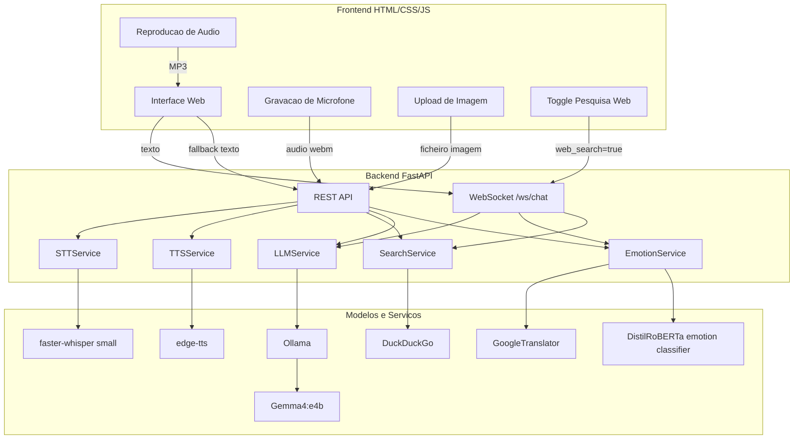
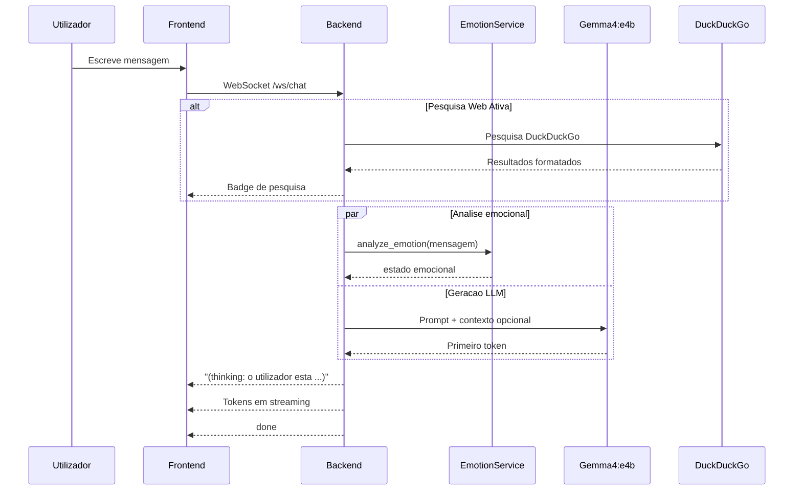
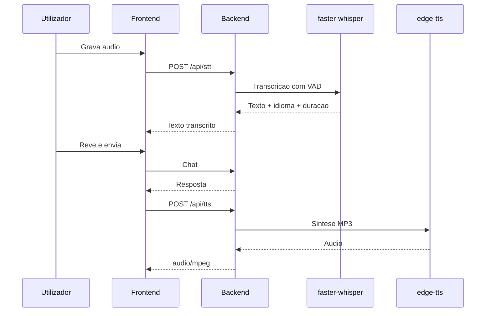

# Assistente IA Local Multimodal - Plano de Implementacao Atualizado

Este documento descreve o estado atual do projeto **Multiopen AI**. A implementacao atual inclui backend, frontend, streaming, STT, TTS, pesquisa web, visao multimodal e a nova skill de **analise emocional** em `backend/emotion_service.py`.

## Contexto do Ambiente

| Recurso | Detalhes |
|---|---|
| Modelo principal | `gemma4:e4b` via Ollama |
| GPU prevista | NVIDIA RTX 5070 Ti Laptop, 12 GB VRAM |
| Python | 3.9.13 |
| Sistema operativo | Windows |
| Diretorio | `trabalho_deep_learning` |
| Backend | FastAPI + Uvicorn |
| Frontend | HTML/CSS/JS puro servido pelo FastAPI |

## Arquitetura Atual



## Estrutura do Projeto

```text
trabalho_deep_learning/
├── backend/
│   ├── main.py              # FastAPI app, rotas e orquestracao dos servicos
│   ├── llm_service.py       # Ollama/Gemma4:e4b, historico, texto, imagem e streaming
│   ├── emotion_service.py   # Nova skill: analise emocional do texto do utilizador
│   ├── stt_service.py       # Speech-to-Text com faster-whisper
│   ├── tts_service.py       # Text-to-Speech com edge-tts
│   ├── search_service.py    # Pesquisa DuckDuckGo e formatacao para RAG
│   └── requirements.txt     # Dependencias Python
├── frontend/
│   ├── index.html           # Interface principal
│   ├── style.css            # Estilos, dark mode e responsividade
│   └── app.js               # Chat, WebSocket, voz, imagem, TTS e pesquisa
├── start.bat                # Arranque automatico em Windows
├── README.md                # Documentacao de utilizacao
└── implementation_plan.md   # Este plano atualizado
```

---

## Estrategia Atual por Skill

### 1. Chat LLM - `llm_service.py`

**Estrategia mantida:** Gemma4:e4b continua a ser o modelo principal, executado localmente via Ollama.

- `LLMService` verifica se `gemma4:e4b` existe no Ollama.
- O system prompt fixa identidade, pt-PT, concisao, seguranca, honestidade, uso de markdown e data/hora atual.
- O historico e guardado em memoria e sao reenviadas ate 20 mensagens recentes.
- Suporta `chat`, `chat_stream`, `chat_with_image`, `chat_with_image_stream`, `clear_history` e `get_history`.

### 2. Analise Emocional - `emotion_service.py`

**Nova skill adicionada.**

- Usa `transformers.pipeline("text-classification")`.
- Modelo: `j-hartmann/emotion-english-distilroberta-base`.
- Como o modelo e otimizado para ingles, o texto e traduzido antes com `GoogleTranslator(source='auto', target='en')`.
- A emocao e mapeada para portugues: alegria, tristeza, raiva, medo, surpresa, nojo ou neutro.
- Se a confianca for inferior a `0.4`, a emocao passa a `neutral`.
- Se houver erro no modelo ou na traducao, o fallback e `neutro`.
- `get_natural_emotion(...)` converte a emocao para uma forma natural, por exemplo `alegria` -> `feliz` e `tristeza` -> `triste`.

**Integracao atual:**

- Em `/api/chat`, a analise emocional corre em paralelo com `llm_service.chat(...)`.
- Em `/api/chat/image`, corre em paralelo com `llm_service.chat_with_image(...)`.
- Em `/ws/chat`, a emocao e calculada em paralelo com a obtencao do primeiro token e enviada primeiro ao frontend.
- A resposta final recebe o prefixo:

```text
(thinking: o utilizador esta <estado>)
```

**Observacao importante:** esta skill nao e totalmente local enquanto usar `GoogleTranslator`. O classificador corre localmente depois de descarregado, mas a traducao pode depender de rede.

### 3. Speech-to-Text - `stt_service.py`

**Estrategia mantida:** faster-whisper continua a ser a solucao STT.

- Modelo usado no arranque: `small`.
- Dispositivo: `auto`.
- Tenta CUDA com `float16`; se falhar, usa CPU com `int8`.
- Usa VAD para reduzir silencio.
- O frontend grava em `audio/webm;codecs=opus`.
- `/api/stt` aceita a extensao original e devolve texto, idioma, probabilidade e duracao.

### 4. Text-to-Speech - `tts_service.py`

**Estrategia ajustada face ao plano antigo:** a implementacao atual usa apenas `edge-tts`; Kokoro nao esta implementado no codigo.

- Voz padrao: `pt-PT-DuarteNeural`.
- Vozes disponiveis:
  - `pt-PT-DuarteNeural`
  - `pt-PT-RaquelNeural`
  - `pt-BR-AntonioNeural`
  - `pt-BR-FranciscaNeural`
- `/api/tts` devolve audio MP3 via `StreamingResponse`.
- `/api/tts/voices` devolve a lista de vozes.
- O frontend limpa markdown, blocos de codigo e emojis antes de enviar texto para TTS.

**Observacao importante:** `edge-tts` usa servicos externos da Microsoft. E gratuito e sem chave, mas nao e 100% local.

### 5. Visao Multimodal - Gemma4:e4b

**Estrategia mantida:** imagem continua a ser enviada para o Gemma4:e4b via Ollama.

- O backend le a imagem, converte para base64 e chama `chat_with_image(...)`.
- O frontend usa REST em `/api/chat/image` para imagens, porque enviar base64 grande por WebSocket pode ser problematico.
- O historico guarda apenas uma marcacao textual da imagem para poupar memoria.

### 6. Pesquisa Web - `search_service.py`

**Estrategia mantida com clarificacao:** pesquisa web e manual via toggle do frontend, nao automatica pelo modelo.

- Usa `duckduckgo-search`.
- Regiao: `pt-pt`.
- Resultado normalizado com `title`, `url` e `snippet`.
- `search_and_format(...)` pesquisa e formata resultados para injecao no prompt.
- Quando `web_search=true`, o backend injeta o contexto no LLM com instrucao para citar fontes quando relevante.

### 7. Backend FastAPI - `main.py`

**Estrategia mantida:** FastAPI orquestra todos os servicos.

Rotas atuais:

| Metodo | Rota | Estado |
|---|---|---|
| GET | `/` | Implementada |
| GET | `/health` | Implementada |
| POST | `/api/chat` | Implementada |
| POST | `/api/chat/image` | Implementada |
| WebSocket | `/ws/chat` | Implementada |
| POST | `/api/stt` | Implementada |
| POST | `/api/tts` | Implementada |
| GET | `/api/tts/voices` | Implementada |
| POST | `/api/search` | Implementada |
| POST | `/api/chat/clear` | Implementada |
| GET | `/api/chat/history` | Implementada |

### 8. Frontend - `frontend/`

**Estrategia mantida:** HTML/CSS/JS puro, sem framework.

- `index.html` define sidebar, chat, botoes, toggles, seletor de voz e input.
- `style.css` implementa dark mode, glassmorphism, layout responsivo e estados visuais.
- `app.js` gere WebSocket com reconexao automatica, fallback REST, upload de imagem, gravacao com `MediaRecorder`, STT, TTS, auto-TTS, limpeza de conversa e markdown basico.

---

## Mudancas Refletidas Neste Plano

1. `emotion_service.py` foi adicionado a estrutura do backend.
2. `main.py` inicializa `EmotionService`.
3. Chat normal, chat com imagem e WebSocket incluem analise emocional.
4. `backend/requirements.txt` inclui:
   - `transformers>=4.35.0`
   - `deep-translator>=1.11.4`
   - `torch>=2.0.0`
5. A documentacao deixou de afirmar que todo o sistema e 100% local sem qualificacao.
6. A estrategia de TTS foi corrigida: implementado `edge-tts`, sem Kokoro no codigo atual.
7. A estrategia de pesquisa foi corrigida: toggle manual no frontend, nao decisao automatica do modelo.
8. As rotas atuais `/health`, `/api/tts/voices`, `/api/chat/clear` e `/api/chat/history` foram documentadas.

---

## Fluxo de Chat Atual



## Fluxo de Voz Atual



---

## Verificacao Recomendada

### Verificacao automatica leve

1. Compilar sintaticamente os ficheiros Python do backend.
2. Confirmar que `backend/requirements.txt` lista todas as dependencias usadas.
3. Confirmar que `README.md` e `implementation_plan.md` mencionam `emotion_service.py`.
4. Confirmar que os endpoints documentados existem em `main.py`.

### Verificacao manual funcional

1. Iniciar `start.bat`.
2. Abrir `http://localhost:8000`.
3. Testar chat por texto e confirmar streaming.
4. Testar pergunta com "Pesquisa Web" ativa.
5. Testar gravacao de voz e transcricao.
6. Testar TTS manual e automatico.
7. Testar upload de imagem.
8. Testar uma mensagem emocional, por exemplo "Estou muito triste hoje", e confirmar que a resposta inclui o prefixo emocional.

---

## Pontos de Atencao

- A analise emocional faz traducao externa antes da classificacao. Se a rede falhar, deve cair em `neutro`.
- O prefixo `(thinking: ...)` esta visivel para o utilizador. Se a intencao for tornar isto privado, a proxima alteracao deve enviar a emocao como metadado separado em vez de texto da resposta.
- O plano antigo mencionava Kokoro como alternativa TTS; isso nao esta implementado nos ficheiros atuais.
- O plano antigo sugeria pesquisa decidida pelo modelo; o frontend atual usa um toggle explicito.
- O frontend mostra o estado STT com base em `/health`, mas tambem remove a classe `online` apos transcricao; vale testar visualmente para garantir que o indicador comunica o estado pretendido.
